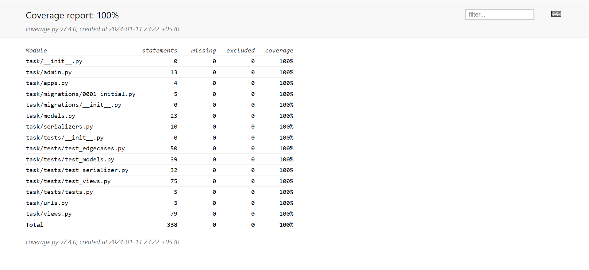

# To-Do-List

## Overview

A To-do List Webapp made using REST Apis with unit and integration testing 

## Prerequisites

1. Python 3.11+
2. Django 4.2.7+
3. Django Rest Framework 3.14.0+


## Getting Started

1. Clone the repository:

    ```bash
    git clone https://github.com/SaurabhSKM/To-Do-List.git
    ```

2. Install dependencies:

    ```bash
    pip install -r requirements.txt
    ```

3. Apply migrations:

    ```bash
    python manage.py migrate
    ```
4. Create a superuser:

    ```
    python manage.py createsuperuser <name>
    ```
## Running the Development Server

Start the Django development server:

```bash
python manage.py runserver
```

## Running the tests

Run the tests using Django's test runner:
```
python manage.py test task.tests
```  
## Coverage Report




